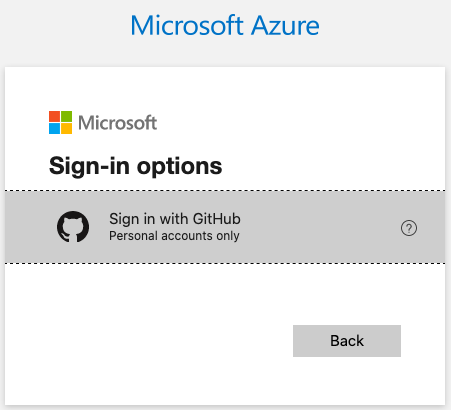

# flask-ml-azure

Sample project to deploy a Flask app on Azure pipelines.


## Install Azure Cli

Check other install procedures [on the Azure docs](https://docs.microsoft.com/en-us/cli/azure/?view=azure-cli-latest)

On OSX:

```
$ brew update && brew install azure-cli
```

It is required to `login` into Azure, which authenticates locally to that cloud:




## Azure Cloud Shell

After logged in, go to [Azure's Cloud Portal](https://portal.azure.com), and click on Cloud Shell. If you don't have any valid subscriptions to Azure you will need to create an active one. If no storage has been provisioned, it needs to be created and associated with the project. This process may take a few minutes.

```text
alfredo@Azure:~$ git clone https://github.com/alfredodeza/flask-ml-azure
Cloning into 'flask-ml-azure'...
...
Unpacking objects: 100% (12/12), done.
Checking connectivity... done.
alfredo@Azure:~$ cd flask-ml-azure/
alfredo@Azure:~/flask-ml-azure$ az webapp up -n flask-ml
webapp flask-ml doesn't exist
Creating Resource group 'alfredodeza_rg_Linux_centralus' ...
Resource group creation complete
Creating AppServicePlan 'alfredodeza_asp_Linux_centralus_0' ...
Creating webapp 'flask-ml' ...
Configuring default logging for the app, if not already enabled
Creating zip with contents of dir /home/alfredo/flask-ml-azure ...
Getting scm site credentials for zip deployment
Starting zip deployment. This operation can take a while to complete ...
Deployment endpoint responded with status code 202
You can launch the app at http://flask-ml.azurewebsites.net
{
  "URL": "http://flask-ml.azurewebsites.net",
  "name": "flask-ml",
  "os": "Linux",
  "runtime_version": "python|3.7",
  "runtime_version_detected": "-",
  "src_path": "//home//alfredo//flask-ml-azure"
}
```

Visit the link in the JSON output and the sample app should be available. To stop the service:

```text
alfredo@Azure:~/flask-ml-azure$ az webapp stop -n flask-ml
```

